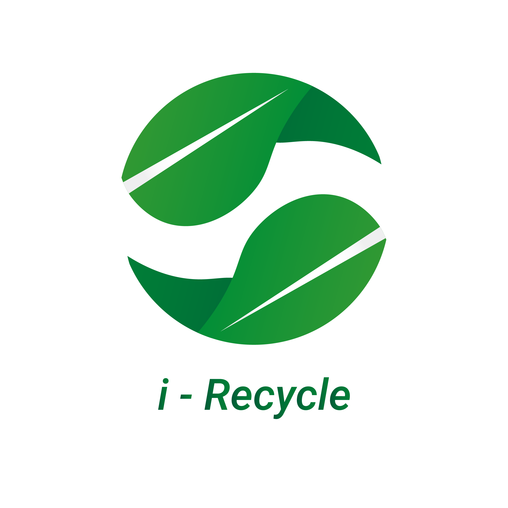

 

  
   

  

    
    
  

  <h1 align="center">Waste Management Project</h1>

<!-- TABLE OF CONTENTS -->

  
<h2 style="display: inline-block">Table of Contents</h2>

  <ol>
    <li>
      <a href="#about-the-project">About The Project</a>
    </li>
    <li><a href="#team-members">Team Members</a></li>
    <li><a href="#our-projects-repository">Our Projects Repository</a></li>
  </ol>

## About The Project

Garbage is a major problem in big cities in Indonesia. Every year, the amount of waste that Indonesia's population continues to increase is not comparable to the collection and processing of waste. The Ministry of Environment and Forestry predicts that the total national waste production will reach 67.8 million tons by 2020. This means that every day the Indonesian population produces around 185,753 tons of waste. Moreover, garbage and household waste during the Covid-19 pandemic are now increasing. The garbage problem is a complex problem.

i recycle comes as an idea that answers the needs of users to solve this waste problem. It is designed to classify waste and educate users about the garbage that is around us.

## Team Members

| Student ID |             Member             |        Path        |                Project Role                |                                                  Contacts                                                  |
| :--------: | :----------------------------: | :----------------: | :----------------------------------------: | :--------------------------------------------------------------------------------------------------------: |
|  M3192859  |        Deborani Siagian        |  Machine Learning  |  Machine Learning Engineer |     [![kia-linkedin][linkedin-shield]][deb-linkedin-url][![kia-github][github-shield]][deb-github-url]     |
|  M3192867  | Yehezkiel Edininta Simanjuntak |  Machine Learning  |         Machine Learning Engineer          |     [![ade-linkedin][linkedin-shield]][kiel-linkedin-url][![ade-github][github-shield]][kiel-github-url]     |
|  C0070726  |       Aditya Paramananda       |  Cloud Computing |              Cloud Engineer              | [![bisma-linkedin][linkedin-shield]][adit-linkedin-url][![bisma-github][github-shield]][adit-github-url] |
|  C0080773  |    Rismanda Tyas Kusumadewi    | Cloud Computing |              Cloud Engineer             | [![bisma-linkedin][linkedin-shield]][risma-linkedin-url][![bisma-github][github-shield]][risma-github-url] |
|  A1931925  |      Setyo Bagus Nugraha       | Mobile Development    |                      Mobile Developer                | [![ferry-linkedin][linkedin-shield]][setyo-linkedin-url][![ferry-github][github-shield]][setyo-github-url] |
|  A3192864  |         Leonardo Wijaya        |  Mobile Development   |                      Mobile Developer              |     [![vio-linkedin][linkedin-shield]][leo-linkedin-url][![vio-github][github-shield]][leo-github-url]     |

## Our Projects Repository

- [i recycle Android Apps](https://github.com/)
- [i recycle RestAPI](https://github.com/)
- [i recycle Clasification](https://github.com/)

## Features of This Projects

- Scan Object
- Got recommendation based on the object result
- Article
- Points

<!-- MARKDOWN LINKS & IMAGES -->
<!-- https://www.markdownguide.org/basic-syntax/#reference-style-links -->
<!-- LinkedIn Link -->

[linkedin-shield]: https://img.shields.io/badge/LinkedIn--blue?style=social&logo=Linkedin
[deb-linkedin-url]: https://www.linkedin.com/in/deborani-siagian-a97620185/
[kiel-linkedin-url]: https://www.linkedin.com/in/yehezkieles
[adit-linkedin-url]: https://www.linkedin.com/
[risma-linkedin-url]: https://www.linkedin.com/in/rismanda-k-791b1211a
[setyo-linkedin-url]: https://www.linkedin.com/
[leo-linkedin-url]: https://www.linkedin.com/

<!-- Github Link -->

[github-shield]: https://img.shields.io/badge/GitHub--blue?style=social&logo=Github
[kiel-github-url]: https://github.com/yehezkielesmjtk
[deb-github-url]: https://github.com/DeboraniSiagian
[adit-github-url]: https://github.com/Aditpara20
[risma-github-url]: https://github.com/risma
[setyo-github-url]: https://github.com/setyobagus01
[leo-github-url]: https://github.com/Leonardowjy
